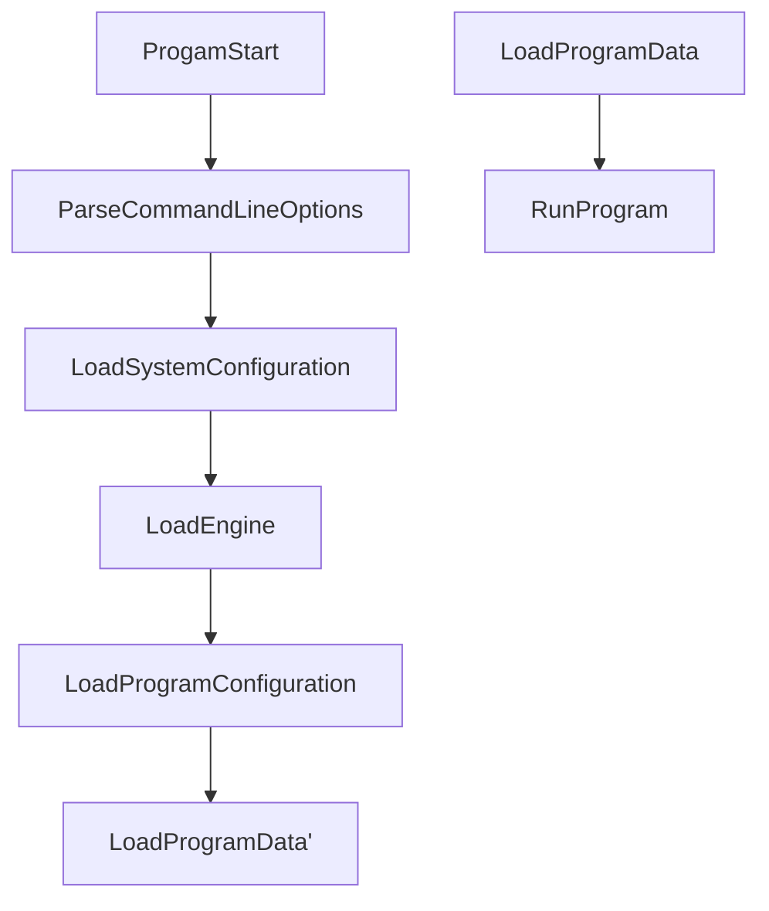

# Mosaic

Overview

Runtime

Kernels
 - Compilation into comparable (JSON or XML)

Modules
  - Language agnostic
  - Definitions
  - Kernel configurations

Language

Flow

```mermaid
graph TD;
    ProgamStart-->ParseCommandLineOptions;
    ParseCommandLineOptions-->LoadSystemConfiguration;
    LoadSystemConfiguration-->LoadEngine;
    LoadEngine-->LoadProgramConfiguration;
    LoadProgramConfiguration-->LoadProgramData'
    LoadProgramData-->RunProgram;
```
